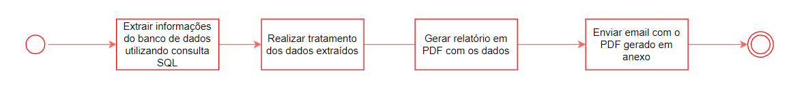
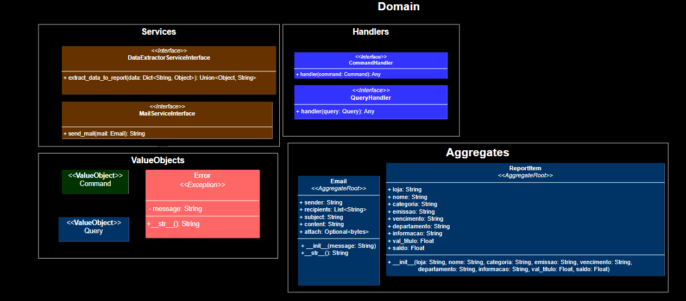
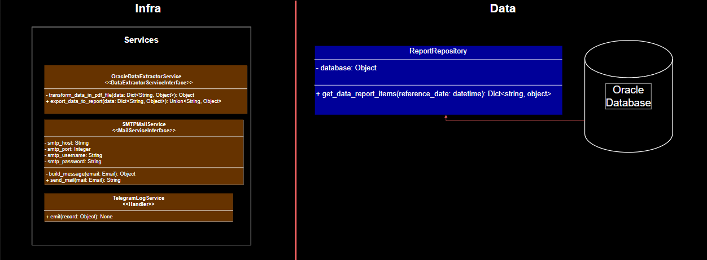
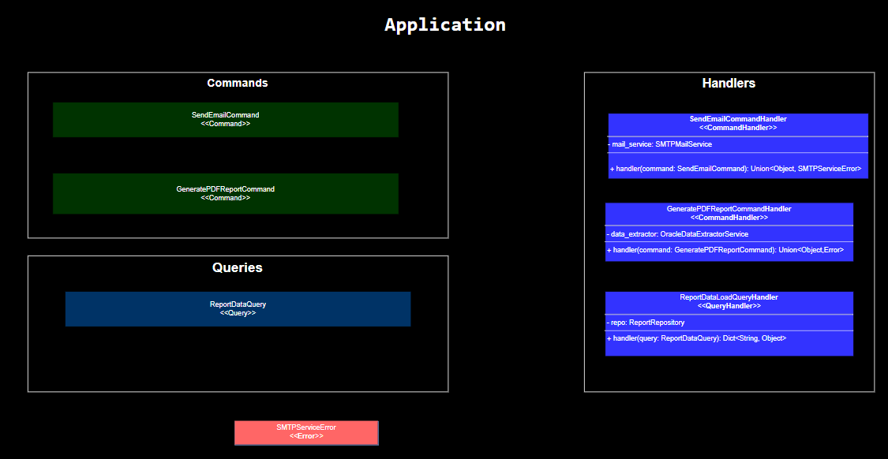

# Contexto do Projeto

Este projeto foi construído com o objetivo de realizar de forma automática uma solicitação de envio de informações em âmbito coporativo.
Foi solicitado que fosse enviado para o email de dois gestores um relatório analítico diário no qual constam todos os títulos a serem pagos com data de vencimento no dia vigente.

# Requisitos do Projeto 

   -  [x] Realizar conexão com banco de dados onde constam as informações dos títulos.
   -  [x] Montar um relatório a partir dos dados da consulta em pdf
   -  [x] Enviar o arquivo com o relatório gerado para o email de dois gestores
   -  [x] Ambiente de Testes
   -  [x] Envio de logs de erro para o Telegram
   -  [x] Agendador de eventos para realizar a tarefa de envio de forma automática

# Definições

O diagrama BPMN abaixo demonstra o fluxo de tarefas da aplicação. Este projeto tem o objetivo de automatizar o fluxo abaixo.

## Arquitetura de Software

Para a construção desse projeto eu optei por utilizar princípios de DDD e arquitetura em camadas. E verdade que dada a baixa complexidade do que se pretendia aqui, esse tipo de abordagem arquitetural soa como uma bazuca para matar uma formiga, mas o obejtivo era também compilar conhecimentos em uma solução para um problema real. Além da clássica estrutra de arquitetura em camadas, dividindo o software em camada de domínio, dados, aplicação e infraestrutura, utilizei 
CQRS(Command Query Responsibility Segregation). As imagens abaixo, mostram como as camadas ficaram após a implementação do código:

  

Vale a ressalva de que eu não pretendi ser ortodoxo na utilização dos princípios de DDD e arquitetura em camadas.
Isso fica notado no fato de que eu criei um serviço sem descrever no domínio da aplicação. Meu objetivo ao fazer essa escolha técnica foi reduzir o nível de abstração e consequentemente a complexidade da implementação.

# Ferramentas utilizadas

 - Python 3.8
 - Oracle Database
 - Pycharm IDE
 - Docker

# Bibliotecas e Frameworks fundamentais

 - Para operações com bancos de dados  [SQLAlchemy](https://www.sqlalchemy.org/)
 - Para agendamento de execução de jobs [APScheduler](https://pypi.org/project/APScheduler/)
 - Para tratamento de dados [Pandas](https://pandas.pydata.org/docs/index.html)
 - Para manipulação de arquivos pdf [Reportlab](https://docs.reportlab.com/)
 - Para envio de emails [Python SMTP protocol client](https://docs.python.org/3/library/smtplib.html)